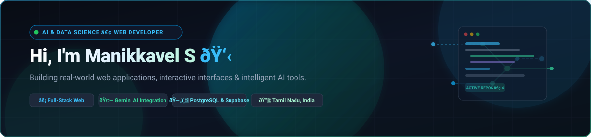

<!-- ================================================================= -->
<!-- MANIKKAVEL S - GITHUB PROFILE README                              -->
<!-- Built with 100% verified real data from github.com/Manikkavel-S   -->
<!-- Theme: Dark Slate / Deep Obsidian with Cyan + Emerald Accents     -->
<!-- ================================================================= -->

<div align="center">

  <!-- Hero Header Banner (SVG Vector with blue-green gradient) -->
  

  <br/><br/>

  <!-- Quick Status Badges -->
  <a href="https://github.com/Manikkavel-S">
    
  </a>
  <a href="https://github.com/Manikkavel-S">
    
  </a>
  <a href="https://github.com/Manikkavel-S">
    
  </a>

  <br/><br/>

  <!-- Social & Connect Badges -->
  <a href="https://www.linkedin.com/in/manikkavel-s-54b1763a1" target="_blank">
    
  </a>
  <a href="https://www.instagram.com/manikkavel_s" target="_blank">
    
  </a>
  <a href="mailto:manikkavelsellappillai@gmail.com">
    
  </a>
  <a href="https://voterverify-taupe.vercel.app" target="_blank">
    
  </a>
  <a href="https://github.com/Manikkavel-S?tab=repositories">
    
  </a>

</div>

<br/>

---

### 👨‍💻 About Me

<table>
  <tr>
    <td width="68%" valign="top">
      <p>
        Hi there! I'm <b>Manikkavel S</b>, an <b>Artificial Intelligence & Data Science student</b> based in Tamil Nadu, India, with a passion for engineering full-stack web applications, interactive user interfaces, and integrating modern AI capabilities.
      </p>
      <ul>
        <li>🎓 <b>Academics:</b> Pursuing <b>B.Tech in Artificial Intelligence & Data Science</b>.</li>
        <li>💻 <b>Full-Stack Development:</b> Building responsive, modular web applications using <b>React (v18/v19), TypeScript, JavaScript, Vite, Tailwind CSS, and Node.js/Express</b>.</li>
        <li>🤖 <b>AI Integration:</b> Integrating LLMs (such as the <b>Google Gemini API</b>) into practical workflows with custom prompt engineering, domain context injection, and safety guardrails.</li>
        <li>🗄️ <b>Databases & Backend:</b> Designing relational schemas, indexes, and secure authentication flows with <b>PostgreSQL, Supabase, and JWT</b>.</li>
        <li>✨ <b>Creative Web:</b> Exploring 3D graphics, physics simulations, and web animations with <b>Three.js, React Three Fiber, and Framer Motion</b>.</li>
        <li>🌱 <b>Philosophy:</b> Solving real-world problems with clean, maintainable code and continuous hands-on experimentation.</li>
      </ul>
    </td>
    <td width="32%" align="center" valign="middle">
      
      <br/>
      <sub><b>Manikkavel S</b></sub><br/>
      <sub><i>AI & Data Science Student</i></sub>
    </td>
  </tr>
</table>

---

### 🛠️ Tech Stack & Tooling

<div align="center">

#### 💻 Programming Languages
<p>
  
  
  
  
  
</p>

#### ⚡ Frontend & UI Engineering
<p>
  
  
  
  
  
  
</p>

#### 🎨 3D Graphics & Animations
<p>
  
  
  
  
</p>

#### ⚙️ Backend, APIs & Authentication
<p>
  
  
  
  
  
</p>

#### 🤖 AI Integration & Data Handling
<p>
  
  
  
</p>

#### 🗄️ Databases & BaaS
<p>
  
  
</p>

#### 🚀 Tools & Deployment
<p>
  
  
  
  
  
  
</p>

</div>

---

### 🌟 Featured Project

<div align="center">
  <h3>🗳️ VoterVerify — College Election Student Verification System</h3>
  <p><b>A secure, high-performance monorepo web platform designed to verify student eligibility, eliminate duplicate voting, and manage elections in real time.</b></p>

  <p>
    <a href="https://voterverify-taupe.vercel.app" target="_blank">
      
    </a>
    <a href="https://github.com/Manikkavel-S/voterverify" target="_blank">
      
    </a>
  </p>
</div>

```
Architecture: Monorepo (Client + Server + Database)
Frontend:    React 18 + Vite + Tailwind CSS + Recharts + Axios
Backend:     Node.js + Express.js + JWT Shield Middleware + Multer
Database:    Supabase PostgreSQL with indexed query lookups
```

#### Key Modules & Capabilities:
- 🔍 **Instant Verification Counter Desk:** Auto-focused sub-second query search for student registration numbers with real-time eligibility card rendering.
- 🛡️ **Double-Voting Prevention:** Marks student records dynamically with vote timestamps, immediately blocking any subsequent duplicate attempts.
- 📊 **Real-Time Analytics Dashboard:** Interactive Recharts data visualizations showing turnout per department, year-wise participation, and staff counter leaderboards.
- 📁 **Bulk Data Management:** Native CSV & Excel template bulk import/export engine (`xlsx`) for onboarding thousands of student and faculty records in seconds.
- 🖨️ **Printable Report Engine:** Custom print stylesheets formatted for physical administrative sign-offs and audit logs.

---

### 📂 More Real-World Projects

<table>
  <tr>
    <td width="50%" valign="top">
      <h4>💊 <a href="https://github.com/Manikkavel-S/medicare-pharmacy">MediCare Pharmacy & AI Assistant</a></h4>
      <p>
        A comprehensive healthcare web platform with dynamic catalog management, prescription upload workflows, express delivery scheduling, and a <b>Gemini 1.5 Flash AI Assistant</b> with clinical safety guardrails.
      </p>
      <p>
        <b>Tech Stack:</b><br/>
        <code>React 19</code> <code>Vite</code> <code>Gemini API</code> <code>Supabase</code> <code>Tailwind CSS</code> <code>Lucide React</code>
      </p>
      <p>
        <a href="https://github.com/Manikkavel-S/medicare-pharmacy">🔗 View Repository</a>
      </p>
    </td>
    <td width="50%" valign="top">
      <h4>🌐 <a href="https://github.com/Manikkavel-S/manikkavel-portfolio">3D Interactive Portfolio & CMS</a></h4>
      <p>
        A modern interactive developer portfolio featuring 3D WebGL particle scenes, Command Palette (Ctrl+K) search, responsive animations, and a Supabase-backed content management dashboard.
      </p>
      <p>
        <b>Tech Stack:</b><br/>
        <code>TypeScript</code> <code>React 19</code> <code>Three.js</code> <code>R3F</code> <code>Framer Motion</code> <code>Tailwind v4</code>
      </p>
      <p>
        <a href="https://github.com/Manikkavel-S/manikkavel-portfolio">🔗 View Repository</a>
      </p>
    </td>
  </tr>
  <tr>
    <td width="50%" valign="top">
      <h4>🏥 <a href="https://github.com/Manikkavel-S/healthcare">Zero-Hour Healthcare Platform</a></h4>
      <p>
        A modern healthcare interface built with React 19, Vite, and Supabase integration, optimized with Oxlint linting and lightweight component architecture.
      </p>
      <p>
        <b>Tech Stack:</b><br/>
        <code>React 19</code> <code>Vite</code> <code>Supabase</code> <code>Oxlint</code> <code>Tailwind CSS</code>
      </p>
      <p>
        <a href="https://github.com/Manikkavel-S/healthcare">🔗 View Repository</a>
      </p>
    </td>
    <td width="50%" valign="top">
      <h4>⚙️ <a href="https://github.com/Manikkavel-S/voterverify">Election Backend & API Engine</a></h4>
      <p>
        High-throughput REST API backend powering real-time election logging, JWT token issuance, file uploads, and PostgreSQL transaction queries.
      </p>
      <p>
        <b>Tech Stack:</b><br/>
        <code>Node.js</code> <code>Express</code> <code>PostgreSQL</code> <code>JWT</code> <code>XLSX</code>
      </p>
      <p>
        <a href="https://github.com/Manikkavel-S/voterverify/tree/main/server">🔗 View Backend Code</a>
      </p>
    </td>
  </tr>
</table>

---

### 📊 Dynamic GitHub Activity

<div align="center">
  
  
</div>

<br/>

<div align="center">
  
</div>

---

### 📬 Let's Connect

<div align="center">
  <p>Whether you'd like to collaborate on an open-source project, discuss AI & web development, or just say hello — feel free to reach out!</p>

  <a href="https://www.linkedin.com/in/manikkavel-s-54b1763a1" target="_blank">
    
  </a>
  &nbsp;
  <a href="https://www.instagram.com/manikkavel_s" target="_blank">
    
  </a>
  &nbsp;
  <a href="mailto:manikkavelsellappillai@gmail.com">
    
  </a>
  &nbsp;
  <a href="https://github.com/Manikkavel-S">
    
  </a>
</div>

<br/>

<div align="center">
  <sub>Code with purpose. Learn continuously. Build solutions that matter. 🚀</sub>
</div>
